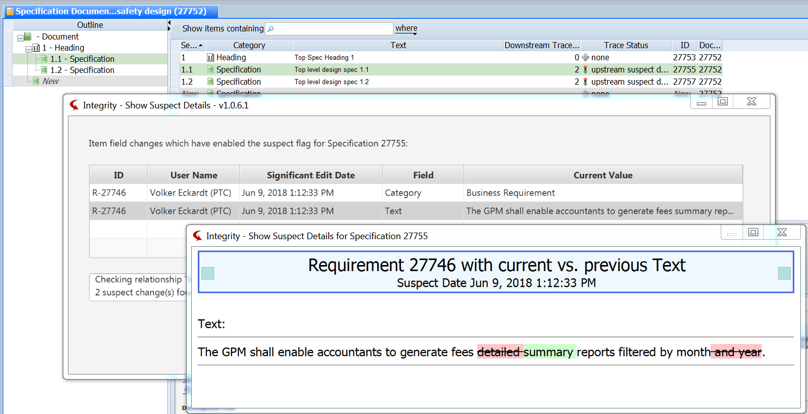

# Integrity Show Suspect Details
This Utility shows the author and the changes caused the Suspect Flag to appear.

## Use Cases
- As a document author, I'd like to see which change has caused the Suspect Flag to appear. 

## Possible Import Layout


## Important
- This tool has been created back in 2015 and is in production since then

## Tested with
- Integrity LM 10.4
- Integrity LM 10.9
- Integrity LM 11.0

## Installation
- Provide the following files locally:

```
#ClientFolder#/IntegrityShowSuspectDetails.jar (new)
#ClientFolder#/lib/IntegrityAPI.jar (new)
#ClientFolder#/lib/daisydiff.jar (new)
#ClientFolder#/lib/jfxmessagebox-1.1.0.jar (new)
#ClientFolder#/lib/mksapi.jar (existing)
```
- Create a Custom Menu Entry as follows:
```
Name:  Show Suspect Details
Program: ..\jre\bin\javaw
Parameter: -jar ..\IntegrityShowSuspectDetails.jar
```

## How to Run
- Select a suspect node (document node with suspect flag set) in any document
- Choose Custom > Show Suspect Details
- The new form for Suspect Details should open
- Review the outcome

## Notes
- Thanks to https://github.com/DaisyDiff/DaisyDiff
- The usabilty should be improved: the second window shall contain all info from the first. Then, only one window is needed. 
